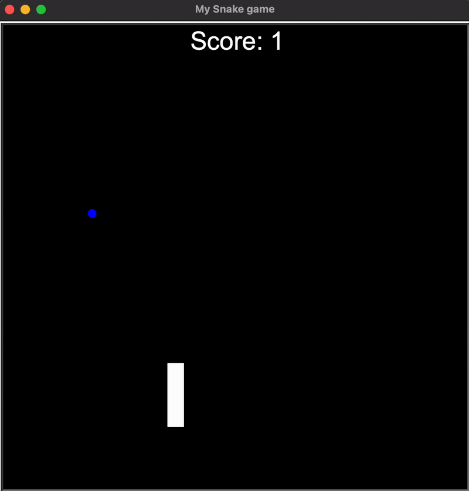

# 🐍 Snake Game with Python Turtle  

A fun & classic **Snake Game** 🎮 built using **Python’s Turtle graphics** module.  
The game features food 🍎, score tracking 🏆, and collision detection 🚧.  

---

## ✨ Features  
- 🐍 Move the snake using arrow keys (⬆️⬇️⬅️➡️)  
- 🍎 Eat the food to grow longer  
- 🏆 Scoreboard updates dynamically  
- 🚧 Game ends when the snake hits the wall or itself  
- 🔁 Restart by running the program again  

---

## 🛠️ Concepts Utilized  
This project is not just a game – it’s also a **Python practice project**:  

- **Object-Oriented Programming (OOP)** 🧩  
  - Classes: `Snake`, `Food`, `Scoreboard`  
  - Encapsulation of game logic  
  - Methods for modular behavior (e.g., `move()`, `extend()`, `refresh()`)  

- **Modular Programming** 📦  
  - Code organized into separate files (`snake.py`, `food.py`, `scoreboard.py`, `main.py`)  

- **Random Module** 🎲  
  - Food position is randomized  

- **Event Listeners** ⌨️  
  - `screen.onkey()` captures keyboard input for snake movement  

---

## ▶️ How to Play  

1. Clone the repo:  
   ```bash
   git clone https://github.com/dharsan19/snake-game-using-python.git
   cd snake-game-using-python
   ```
2.	Run the game:
    ```bash
    python main.py
    ```
3.	Use arrow keys ⬆️⬇️⬅️➡️ to control the snake.
4.	Eat the food 🍎 to score points.
5.	Avoid hitting the wall 🚧 or yourself 🔁.

## 🎥 Demo

<p align="center">
  
</p>